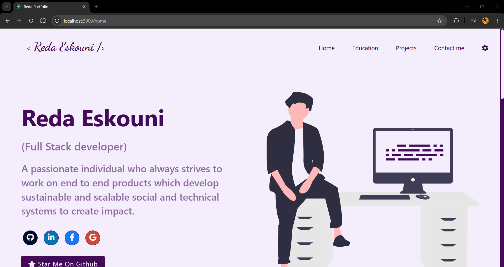
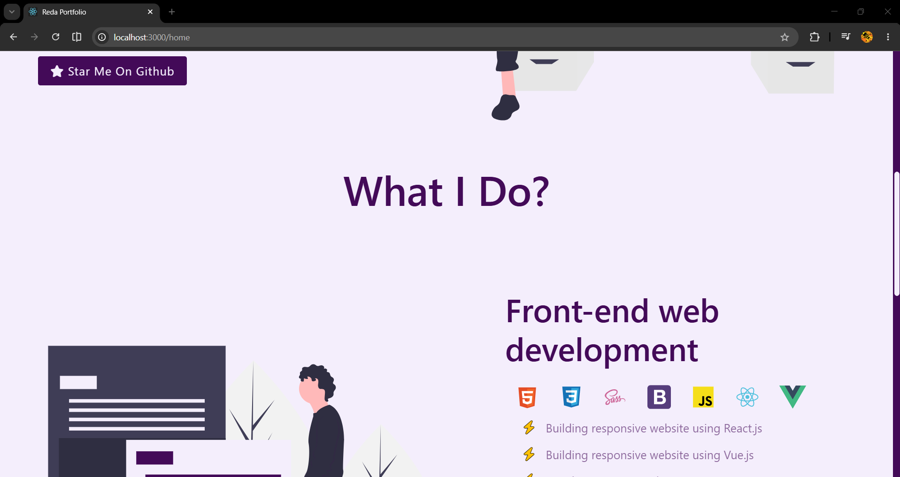
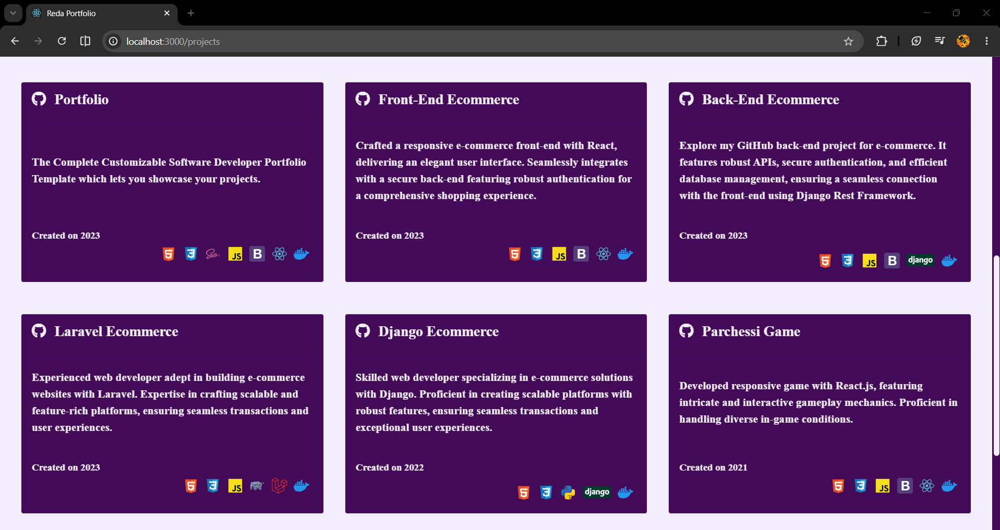

# 🚀 Reda Eskouni Portfolio

A modern and responsive personal portfolio website built with React.js to showcase my skills, education, projects, and contact information.

## 📋 Overview

This portfolio was created to present my work, technical skills, and background as a Front-End Developer. It features a clean design, smooth navigation, and a responsive layout for all screen sizes.

## ✨ Features

- Responsive design
- Modern user interface
- Splash screen animation
- Personal introduction section
- Education section
- Projects showcase
- Contact section
- Reusable React components

## 🛠️ Tech Stack

- React.js
- JavaScript (ES6+)
- HTML5
- SCSS / Sass
- CSS3

## 📂 Project Structure

```text
src/
├── components/
│   ├── aside/
│   ├── contact/
│   ├── education/
│   ├── footer/
│   ├── header/
│   ├── home/
│   ├── project/
│   └── splash/
├── assets/
├── App.jsx
├── App.sass
└── index.js
```

## 🚀 Getting Started

### Clone the repository

```bash
git clone https://github.com/RedaFarissi/front-portfolio.git
```

### Navigate to the project directory

```bash
cd front-portfolio
```

### Install dependencies

```bash
npm install
```

### Run the development server

```bash
npm start
```

The application will be available at:

```text
http://localhost:3000
```

## 📸 Screenshots

Add screenshots of the portfolio here.

### Home Section



### Projects Section


## 📬 Contact

Feel free to connect with me:

- GitHub: https://github.com/RedaFarissi
- LinkedIn: https://www.linkedin.com/in/reda-eskouni-aa4361209/
- Email: redaesskouni@gmail.com

## 📄 License

This project is open-source and available under the MIT License.
